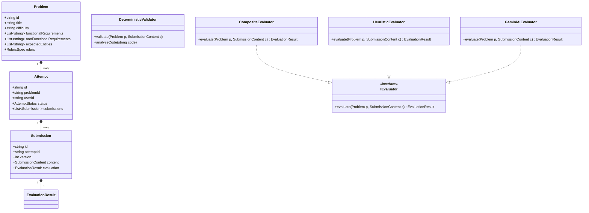

# CipherSchools LLD Practice Studio

A focused, extensible Low-Level Design (LLD / Object-Oriented Design) Practice & Evaluation Platform built for the CipherSchools 2-Day Engineering Assignment.

---

## 🌟 Overview & Key Features

The platform provides a complete, structured practice loop for mastering Low-Level Design interviews:

1. **Curated Problem Catalog**: 5 real-world LLD problems with clear functional requirements, non-functional goals, constraints, expected entities, and reference key concepts:
   - *Multi-Floor Smart Parking Lot System*
   - *Elevator Dispatch & Management System*
   - *Distributed API Rate Limiter*
   - *Expense Sharing Application (Splitwise Clone)*
   - *Snake & Ladder Board Game Engine*
2. **Multi-Faceted Practice Studio**:
   - **Assumptions & Scope**: Define scale, boundaries, and trade-offs.
   - **Visual Class Diagram**: Interactive Mermaid syntax editor with live rendered SVG class diagrams.
   - **Polymorphic Code Implementation**: Multi-language support (TypeScript, Java, Python, C++) with starter boilerplate.
   - **Design Patterns & Rationale**: Document GoF patterns, concurrency guards, and SOLID principles.
3. **Hybrid Evaluator Pipeline (`IEvaluator`)**:
   - **Deterministic Validator**: Instant static structural checks (class count, interface contracts, enum usage, anti-pattern detection).
   - **Rubric-Grounded Evaluation**: 5-dimension weighted scoring (*Domain Modeling*, *Abstraction*, *Extensibility*, *Edge Cases & Concurrency*, *Rationale*).
   - **Zero-Config Offline Heuristic Engine**: Works 100% out of the box with realistic feedback without requiring API keys.
   - **Optional Live AI Evaluation**: Seamlessly connects to Google Gemini (`GEMINI_API_KEY`) when available.
4. **Learning Loop & Progress Tracking**:
   - Compare Attempt $N$ vs $N-1$ with score deltas ($+15$ on Abstraction).
   - Track addressed design smells and progressive architectural improvements over time.

---

## 🚀 Quickstart Guide

### Prerequisites
- Node.js (v18+)
- npm (v9+)

### Installation & Running Locally

1. **Clone or navigate to the repository directory**:
   ```bash
   cd Assigment
   ```

2. **Install all dependencies** (Backend & Frontend):
   ```bash
   npm run build
   ```

3. **Start both Backend and Frontend concurrently**:
   ```bash
   npm run dev
   ```
   - **Backend API**: Running at `http://localhost:4000`
   - **Frontend UI**: Running at `http://localhost:5173`

---

## 🧪 Running Automated Tests

Run the full Vitest automated test suite:
```bash
npm test
```
Tests cover:
- Deterministic validator structural and anti-pattern checks
- Heuristic evaluator multi-dimensional rubric calculations
- Practice service attempt lifecycle, state transitions, and version comparisons
- Express REST API endpoints via `supertest`

---

## 📐 Domain Architecture & Class Diagram

The platform itself is an exemplary piece of Low-Level Design:



---

## 📁 Repository Structure & Deliverables

- [`RESEARCH_NOTE.md`](./RESEARCH_NOTE.md): 2-page research note on learner problems, existing tools (LeetCode, Educative, Interviewing.io), key gaps, and product vision.
- [`DESIGN_NOTE.md`](./DESIGN_NOTE.md): Detailed design note covering domain models, class responsibilities, deterministic vs AI evaluation boundaries, Change Tests A & B, and trade-offs.
- [`AI_USAGE.md`](./AI_USAGE.md): Detailed explanation of 4 key AI-assisted decisions, accepted/rejected suggestions, and engineering rationale.
- `backend/`: Node.js + TypeScript Express REST API with clean domain layers and evaluators.
- `frontend/`: React + Vite + TypeScript application with glassmorphic dark-mode UI, live Mermaid diagrams, and rubric dashboards.
- `backend/tests/`: Automated unit and integration test suite.
